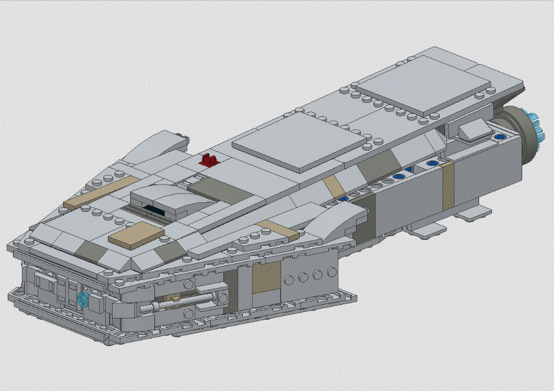

# LEGO® 75192 EscapePod

These are the LDraw files describing the assemblies for an Escape Pod that goes with LEGO model 75192 Millennium Falcon UCS.

I designed this MOC in 2018 and shared it on the [LDraw forum](https://forums.ldraw.org/thread-23285.html) (unfortunately without a license).
Now, by chance, I find several users who present very similar Escape Pods who obviously use my structural design, which is okay, because I shared it ... but unfortunately, the builders don't have the fainess to point out that their MOC is based on someone else's (me) ideas.

